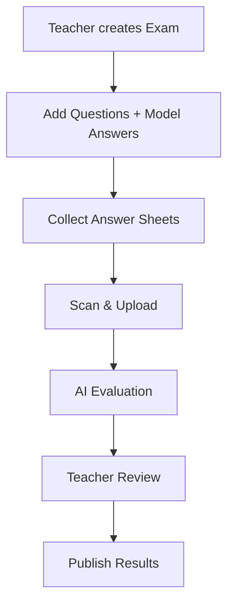

# 🎓 Grading AI — Intelligent Assessment Engine

> **Minor Project**
> An end-to-end AI-powered grading platform that automates evaluation of handwritten answer sheets using OCR and NLP.

---

## 🌟 Project Overview

**Grading AI** is designed to transform the traditional exam evaluation process by enabling teachers to:

* 📄 Upload scanned handwritten answer sheets
* 🤖 Automatically evaluate answers using AI
* 📊 Generate scores, analytics, and feedback instantly
* ✅ Review and override AI decisions before publishing

This system ensures **accuracy, efficiency, and academic integrity**.

---

## 👥 Team & Contributions

| Name                | Role                      | Responsibility                       |
| ------------------- | ------------------------- | ------------------------------------ |
| **Nikunj Kaushik**  | Team Lead & AI Specialist | OCR + NLP Engine, System Integration |
| **Manya Juneja**    | Frontend Architect        | UI Design, Landing Page              |
| **Prarthna Gautam** | Product & UX              | Dashboard, Student Registry          |
| **Garvit Sharma**   | Backend Developer         | FastAPI APIs, Database, Auth         |

---

## 🧠 Key Features

### 🔐 Secure & Role-Based Access

* JWT Authentication (Teacher login)
* Protected evaluation environment

### 🧾 Smart Paper Processing

* EasyOCR + OpenCV preprocessing
* Accurate handwritten text extraction

### 🤖 AI-Based Evaluation

* Semantic similarity using SentenceTransformers
* Keyword-based scoring system
* Multi-metric evaluation pipeline

### 📊 Teacher Dashboard

* Score distribution analytics
* Student performance insights
* Manual override system

### 🎯 Student Portal

* Result lookup via roll number
* Personalized feedback

### 📁 Export & Reports

* Excel export (.xlsx)
* Structured evaluation reports

---

## 🛡️ Academic Integrity System

* 🚫 Students cannot upload answer sheets
* 🧑‍🏫 Teacher-controlled evaluation workflow
* 🔍 AI-assisted cheat detection mechanisms
* ✅ Final approval by teacher before publishing

---

## ⚙️ Tech Stack

| Layer    | Technology                                 |
| -------- | ------------------------------------------ |
| Frontend | React + Vite + TailwindCSS + Framer Motion |
| Backend  | FastAPI (Python)                           |
| Database | SQLite (SQLAlchemy)                        |
| OCR      | EasyOCR + OpenCV                           |
| NLP      | SentenceTransformers (MiniLM)              |
| Auth     | JWT (python-jose + bcrypt)                 |

---

## 🔄 System Workflow



---

## 🚀 Quick Start (Local Setup)

### 1️⃣ Clone the repository

```bash
git clone https://github.com/your-username/project-name.git
cd project-name
```

### 2️⃣ Run the project

Double-click:

```bash
run_projexa.bat
```

---

### 🔑 Default Login

```
Email: teacher@projexa.com  
Password: admin123
```


---

## 📸 Screenshots


### 🏠 Landing Page


### 📊 Dashboard


### 📄 Evaluation Interface


---

## 🔮 Future Improvements

* 🌍 Cloud deployment (AWS / Render)
* 🧠 Advanced NLP scoring (LLMs)
* 📱 Mobile-friendly UI
* 🔍 Improved handwriting recognition

---

## 📌 Conclusion

Grading AI demonstrates how **AI can revolutionize education systems** by automating evaluation while maintaining fairness and control.

---

## 🙌 Acknowledgment

Developed as a **Minor Project at KR Mangalam University (2026)**

---

⭐ *If you found this project interesting, consider starring the repo!*
