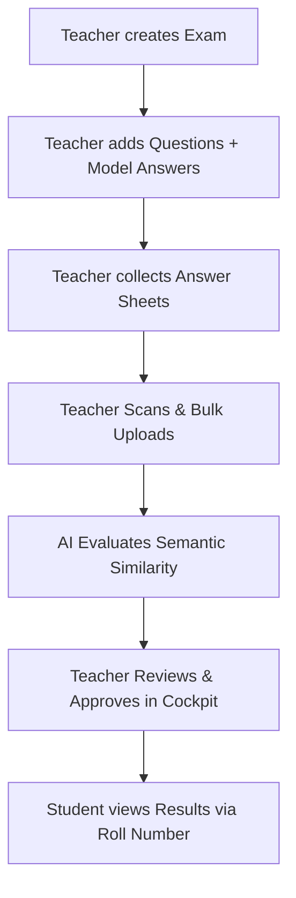

# 🎓 Grading AI — Intelligent Assessment Engine

> **Minor Project | KRMU 2026**
> An intelligent, end-to-end automated exam grading platform built for teachers. Upload handwritten answer sheets, get AI-generated scores and feedback instantly.

---

## 👥 The Team

| Name | Role | Core Responsibility |
|---|---|---|
| **Nikunj Kaushik** | **Team Lead & AI Specialist** | AI Engine (EasyOCR + NLP Evaluation), Final Integration |
| **Manya Juneja** | **Frontend Architect** | System UI Design, Navbar, and Landing Page |
| **Prarthna Gautam** | **Product & UX Design** | Interactive Dashboard, Student Registry, and Result Lookup |
| **Garvit Sharma** | **Backend Infrastructure** | FastAPI Services, Database Schema, and Auth Logic |

---

## 🛡️ Anti-Cheating & Integrity First
Unlike basic upload tools, **Grading AI** is designed with institutional integrity in mind:
- **Teacher-Only Uploads**: Students cannot use phones to upload. Teachers collect physical sheets and perform a bulk scan.
- **AI-Verified Handwriting**: The OCR engine is fine-tuned to extract handwritten text with high fidelity, preventing manual manipulation.
- **Cheat Detection**: Students only have access to a **Result Lookup** portal after the teacher has verified and approved the AI grades.

---

## 🚀 Quick Start (One Click)

Double-click **`run_projexa.bat`** in the project root.

This will:
1. Start the FastAPI backend on `http://localhost:8000`
2. Start the React frontend on `http://localhost:5173`

**Default Admin Login:** `teacher@projexa.com` / `admin123`

---

## 🧠 Tech Stack

| Layer | Technology |
|---|---|
| **Frontend** | React + Vite + TailwindCSS + Framer Motion |
| **Backend** | FastAPI (Python) |
| **Database** | SQLite (via SQLAlchemy) |
| **OCR Engine** | EasyOCR + OpenCV (preprocessing pipeline) |
| **NLP Scoring** | SentenceTransformers (all-MiniLM-L6-v2) + Multi-Metric Semantic Analysis |
| **Auth** | JWT Bearer Tokens (python-jose + bcrypt) |

---

## 📖 How It Works

## ✅ Features Checklist

- [x] JWT Authentication (teacher login)
- [x] Teacher Scans & Ingests student papers directly (Integrity Priority)
- [x] Bulk student answer uploads via Teacher Workspace
- [x] EasyOCR with advanced OpenCV preprocessing
- [x] Hybrid AI scoring (semantic NLP + keyword matching)
- [x] Teacher verification & score override UI
- [x] Student roll number auto-detection from scans
- [x] Student Registry & Result Lookup portal
- [x] Analytics dashboard with score distribution
- [x] Personalized 3-step AI action plan per student
- [x] Export scores to Excel (.xlsx)
- [x] One-click launcher script

---

*Grading AI — A Minor Project by KR Mangalam University Students (2026)*
